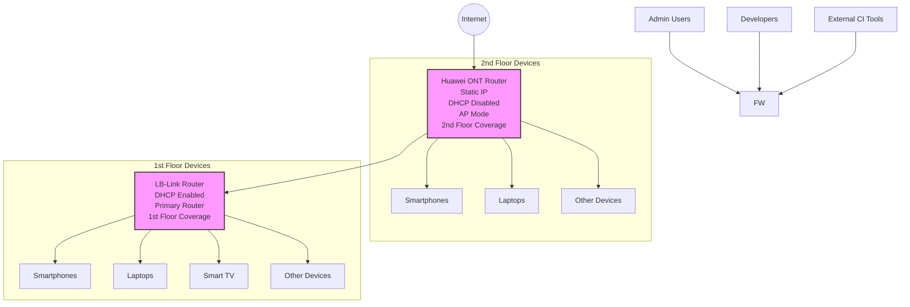

## Wifi-Optimization
# Home Network Configuration Project

As part of my self-learning journey into **network engineering**, I recently configured a dual-router setup using a **Huawei ONT Router** and a **LB-Link Router** to enhance signal strength, optimize internet speed, and enable seamless device connectivity.

### Key Accomplishments

- Set up a **LAN-to-LAN bridge** between the routers to allow better coverage while avoiding IP conflicts.
- Assigned a **static IP** to the Huawei router within the subnet managed by the LB-Link router.
- Disabled DHCP on the Huawei router and enabled it on the LB-Link to centralize IP allocation.
- Merged **2.4 GHz and 5 GHz bands** under a unified SSID for better signal handoff and device roaming.
- Adjusted advanced wireless settings including **channel width, transmission power, and beacon intervals**.
- Verified performance via `speedtest-cli` and system diagnostics:
  - **Ping:** ~29 ms  
  - **Download:** ~5.37 Mbps  
  - **Upload:** ~5.23 Mbps  

This setup significantly improved the network’s **coverage**, **stability**, and **device response time**.

---

### Network Topology Diagram

